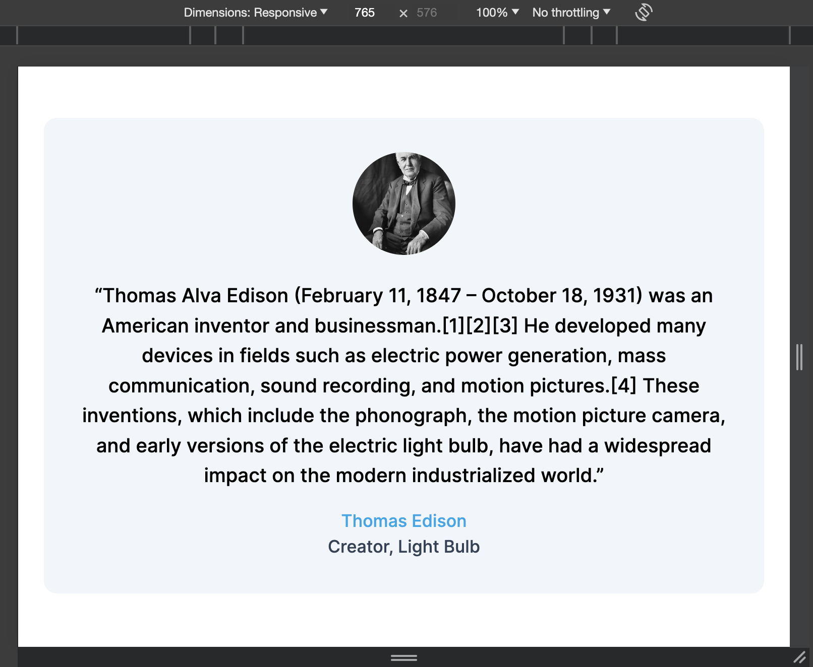
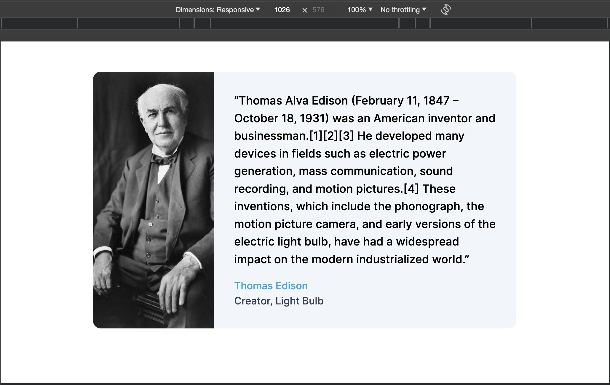

# Assignment

Our goal for this assignment is to test your ability to learn new technologies. Your technical interview will be based on the concepts used to finish this assignment.

To work on this assignment, clone this repo and start the server using `npm run dev`. Also, run `npm run codegen:watch` on a seprate terminal widnow to generate graphql code as you edit/add graphql queries.

To submit a solution, please clone this repo and share the link to the github repo. Please email me at `suraj.keshri@ask2.ai` once you are finished.

## Task 1: Tailwind

Go to page `/profile`. You need to edit the profile card using tailwindcss. The card is responsive and changes it's format at `md` breakpoint (765px). Your goal is to make this card look as close as possible to the images below using tailwindcss. Please feel free to use the documentation to learn tailwind.

Image at size smaller than md

Default size

## Task 2: GraphQL and Relay

The root/index page of this app displays the list of people from the starwars graphql API. Note that the list is infinitely scrollable. For each person in the list, we display their name and birth year. Also, we can see the list of films they are featured in by clicking on the `Show Films` button below their name. On clicking this button, we query the graphql api to get the list of films. The index page is rendered by the `HomePage` component exported by the `HomePage.tsx` file. This file is responsible for fetching the data and passing the reference of the fragment to the component that is being rendered (`Home` component exported by `Home.tsx`).

Your task is to create a page `/films` which displays an infinitely scrollable list of films with their `title` and `releaseDate`. One can see the list of species in a film by clicking on a button `Show Species`. You can follow the steps similar to the home page. You might want to `components/Films.tsx` and `pages-lib/FilmsPage.tsx` similar to the `Home` example.

Feel free to refer to [Relay](https://relay.dev) and [GraphQL](https://graphql.org/) documentation.

If you get stuck and something doesn't work, please feel free to reach out to my email `suraj.keshri@ask2.ai`. You have one week to finish this assignment.
